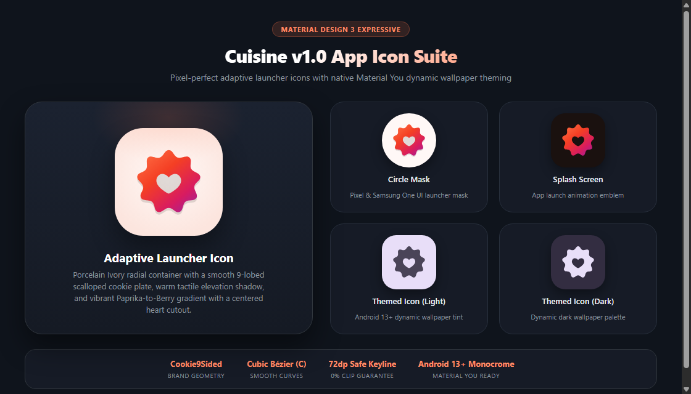

# Cuisine 🍽️✨

> **Your gallery, served fresh.**  
> A private-by-design Android gallery and social feed that transforms your camera roll into an immersive feed, stories, reels, and pinboard — entirely on-device with zero cloud uploads.

[](https://github.com/YashjitPal/Cuisine/releases/latest)
[-4CAF50?style=for-the-badge&logo=android&logoColor=white)](https://github.com/YashjitPal/Cuisine/releases/download/v1.0.0/Cuisine-v1.0.apk)
[-3DDC84?style=for-the-badge&logo=android&logoColor=white)](https://android.com)
[](https://developer.android.com/jetpack/compose)

---

## 🎨 Material 3 Expressive Icon Suite

Cuisine features an authentic **Material 3 Expressive** adaptive icon with full Android 13+ dynamic wallpaper theming support:

<p align="center">
  
</p>

- **Porcelain Ivory Canvas**: Soft radial surface (`#FFFFF9F7` → `#FFFCE5DE`) matching Google Pixel first-party apps.
- **Brand Mark (`Cookie9Sided`)**: Mathematically smooth cubic Bézier 9-lobed scalloped cookie with an expressive centered heart cutout.
- **Flavour Gradient**: Sweeps through **Paprika Coral** (`#FFFF7347`), **Rose Berry** (`#FFD81B60`), and **Violet Plum** (`#FF8E24AA`).
- **Dynamic Themed Icon**: Natively adapts to your wallpaper's color palette on Android 13, 14, 15, and 16.

---

## 📸 Screenshots

<!-- Drop screenshots in docs/screenshots/ (feed.png, reels.png, pinboard.png, flavors.png) to display them here -->

<table align="center">
  <tr>
    <td align="center" width="25%">
      <b>Social Feed & Stories</b><br><br>
      
    </td>
    <td align="center" width="25%">
      <b>Vertical Reels Player</b><br><br>
      
    </td>
    <td align="center" width="25%">
      <b>Spatial Pinboard</b><br><br>
      
    </td>
    <td align="center" width="25%">
      <b>Theme & Flavours</b><br><br>
      
    </td>
  </tr>
</table>

> [!TIP]
> To add your own live screenshots, save four PNG files (`feed.png`, `reels.png`, `pinboard.png`, and `flavors.png`) into the [`docs/screenshots/`](docs/screenshots/) folder and commit them.

---

## ✨ Features

- **📱 Local Social Feed**: Reimagines your camera roll as a rich, chronological social feed with likes, bookmarks, comments, and date-based stories.
- **🎬 Reels**: Smooth vertical video player powered by AndroidX Media3 ExoPlayer with gesture scrubbing, tap-to-pause, and volume toggles.
- **👤 On-Device Face Recognition**: Automatically tags and clusters people across your photos using Google ML Kit Face Detection and a lightweight LiteRT MobileFaceNet embedding model. All inference runs locally on your device hardware.
- **🎨 Material You & M3 Expressive**:
  - Full support for Android 12+ dynamic color extraction from your wallpaper.
  - 5 custom handcrafted palette flavors: **Paprika**, **Saffron**, **Basil**, **Blueberry**, and **Plum**.
  - Animated color cross-fading and Material 3 Expressive motion schemes.
  - Native adaptive launcher icon and Android 13+ themed icon support.
- **📌 Spatial Pinboard & Library**: Organize your favorite photos and videos onto an interactive pinboard canvas.
- **🔒 Zero Cloud Uploads**: Complete privacy by design. There is no backend server, no tracking, and no internet network traffic.
- **💾 Portable JSON Backups**: Easily export and import your tags, likes, people mappings, and profile metadata.

---

## 📥 Download APK (v1.0)

Grab the compiled release APK directly from GitHub Releases:

- 🚀 **[Download Cuisine-v1.0.apk (Direct)](https://github.com/YashjitPal/Cuisine/releases/download/v1.0.0/Cuisine-v1.0.apk)**
- 📦 **[View All Releases](https://github.com/YashjitPal/Cuisine/releases)**

*Compatibility: Android 10 (API 29) through Android 16 (API 37+). Supported architectures: `arm64-v8a`, `x86_64`.*

---

## 🛠️ Architecture & Tech Stack

Cuisine is built using modern Android engineering practices:

| Component | Technology | Description |
|---|---|---|
| **UI Framework** | [Jetpack Compose](https://developer.android.com/jetpack/compose) | Declarative UI with Material 3 Expressive components |
| **Navigation** | [Navigation 3](https://developer.android.com/guide/navigation) | Type-safe single-activity navigation architecture |
| **Video Playback** | [AndroidX Media3 ExoPlayer](https://developer.android.com/media/media3) | High-performance hardware video playback engine |
| **Image Loading** | [Coil 3](https://coil-kt.github.io/coil/) | Coroutine-first asynchronous image & video decoder |
| **Machine Learning** | [Google ML Kit](https://developers.google.com/ml-kit) + [LiteRT](https://ai.google.dev/edge/litert) | On-device face detection + MobileFaceNet face clustering |
| **Vector Geometry** | [AndroidX Graphics Shapes](https://developer.android.com/reference/androidx/graphics/shapes/package-summary) | Morphing organic polygons and expressive shapes |

---

## 🔨 Building from Source

### Prerequisites
1. **JDK 17 or 21**
2. **Android SDK Platform 37** (installed via Android Studio or command-line tools)
3. **Gradle 9+** (managed via `./gradlew`)

### Build Steps

```bash
git clone https://github.com/YashjitPal/Cuisine.git
cd Cuisine

# Build the release APK
./gradlew assembleRelease
```

The compiled release APK will be located at:
```
app/build/outputs/apk/release/app-release.apk
```

---

## 📄 License

```
Copyright 2026 Cuisine Contributors

Licensed under the Apache License, Version 2.0 (the "License");
you may not use this file except in compliance with the License.
You may obtain a copy of the License at

    http://www.apache.org/licenses/LICENSE-2.0

Unless required by applicable law or agreed to in writing, software
distributed under the License is distributed on an "AS IS" BASIS,
WITHOUT WARRANTIES OR CONDITIONS OF ANY KIND, either express or implied.
See the License for the specific language governing permissions and
limitations under the License.
```
